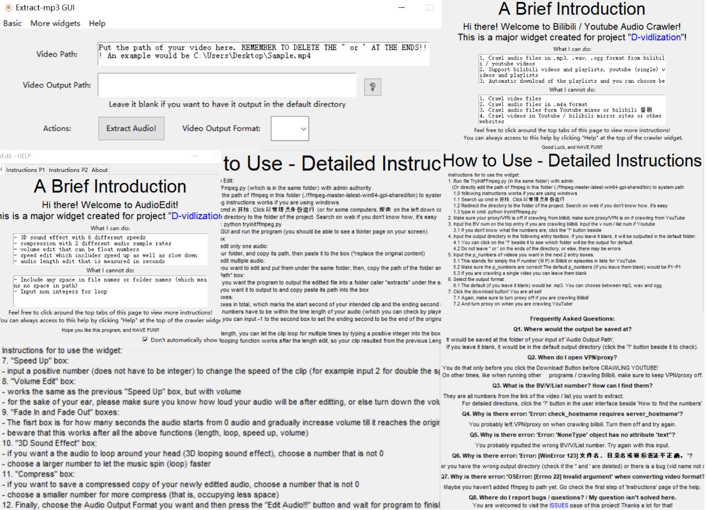
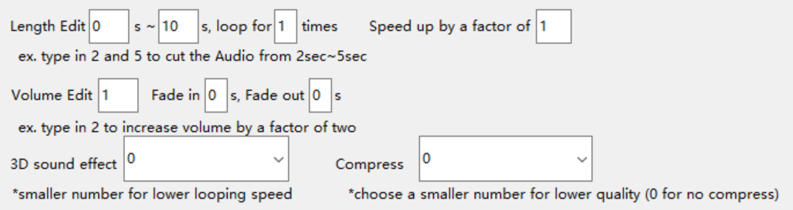
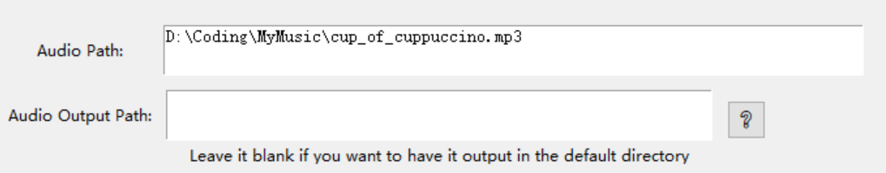
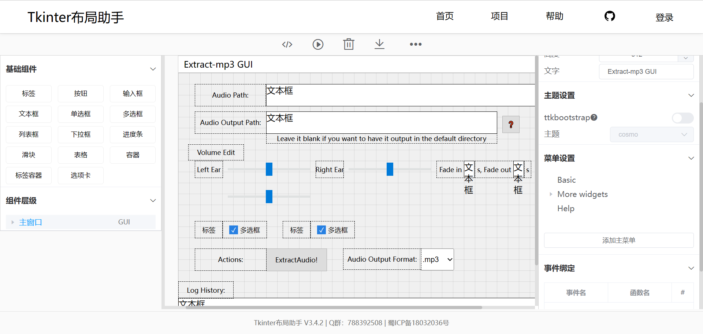

<!--
*** Thanks for checking out the Best-README-Template. If you have a suggestion
*** that would make this better, please fork the repo and create a pull request
*** or simply open an issue with the tag "enhancement".
*** Don't forget to give the project a star!
*** Thanks again! Now go create something AMAZING! :D
-->

<!-- PROJECT SHIELDS -->
<!--
*** I'm using markdown "reference style" links for readability.
*** Reference links are enclosed in brackets [ ] instead of parentheses ( ).
*** See the bottom of this document for the declaration of the reference variables
*** for contributors-url, forks-url, etc. This is an optional, concise syntax you may use.
*** https://www.markdownguide.org/basic-syntax/#reference-style-links
-->

<!-- PROJECT LOGO -->
 

  

<h3 align="center">D-vidlization</h3>

  

    Includes Audio Extract, Audio Crawling, various Audio Edit Functions, and also ffmpeg auto setup!
     
    <a href="https://github.com/CupofCuppuccino/D-vidlization""><strong>Explore the docs »</strong></a>
     
     
    <a href="https://github.com/CupofCuppuccino/D-vidlization">View Demo</a>
    ·
    <a href="https://github.com/CupofCuppuccino/D-vidlization/issues">Report Bug</a>
    ·
    <a href="https://github.com/CupofCuppuccino/D-vidlization/issues">Request Feature</a>
  

<!-- TABLE OF CONTENTS -->

  
Table of Contents

  <ol>
    <li>
      <a href="#about-the-project">About The Project</a>
      <ul>
        <li><a href="#built-with">Built With</a></li>
      </ul>
    </li>
    <li>
      <a href="#getting-started">Getting Started</a>
      <ul>
        <li><a href="#prerequisites">Prerequisites</a></li>
        <li><a href="#installation">Installation</a></li>
      </ul>
    </li>
    <li><a href="#usage">Usage</a></li>
    <!--<li><a href="#roadmap">Roadmap</a></li>-->
    <li><a href="#contributing">Contributing</a></li>
    <li><a href="#license">License</a></li>
    <li><a href="#contact">Contact</a></li>
    <li><a href="#acknowledgments">Acknowledgments</a></li>
  </ol>

<!-- ABOUT THE PROJECT -->
## About The Project

(<a href="#top">back to top</a>)

### Built With

* [Python](https://www.python.org)
	* ffmpeg & moviepy
* [Tkinter布局助手](https://www.pytk.net/tkinter-helper)
* [Markdown Guide](https://www.markdownguide.org)

(<a href="#top">back to top</a>)

<!-- GETTING STARTED -->
## Getting Started

Here are the steps for our program~

### Prerequisites

Our program is based on Python, and most of our external libraries are automatically downloaded in cmd if the program failed to import them. As for ffmpeg, we included a program to auto initialize it onto user's computer, which makes set ups more convinient.

### Installation

1. Download the zip file from github
2. Unpack it
3. Run the "gui.py" file

(<a href="#top">back to top</a>)

<!-- USAGE EXAMPLES -->
## Usage

(<a href="#top">back to top</a>)

<!-- ROADMAP
## Roadmap

- [] Feature 1
- [] Feature 2
- [] Feature 3
    - [] Nested Feature

See the [open issues](https://github.com/CupofCuppuccino/D-vidlization/issues) for a full list of proposed features (and known issues).

(<a href="#top">back to top</a>)

-->

<!-- CONTRIBUTING -->
## Contributing

Contributions are what make the open source community such an amazing place to learn, inspire, and create. Any contributions you make are **greatly appreciated**.

If you have a suggestion that would make this better, please fork the repo and create a pull request. You can also simply open an issue with the tag "enhancement".
Don't forget to give the project a star! Thanks again!

1. Fork the Project
2. Create your Feature Branch (`git checkout -b feature/AmazingFeature`)
3. Commit your Changes (`git commit -m 'Add some AmazingFeature'`)
4. Push to the Branch (`git push origin feature/AmazingFeature`)
5. Open a Pull Request

(<a href="#top">back to top</a>)

<!-- LICENSE -->
## License

Distributed under the MIT License. See `LICENSE.txt` for more information.

(<a href="#top">back to top</a>)

<!-- CONTACT -->
## Contact

CupofCuppuccino - 1928356570@1928356570_client.com

Abyss-Seeker - to be written

Project Link: [https://github.com/CupofCuppuccino/D-vidlization](https://github.com/CupofCuppuccino/D-vidlization)

(<a href="#top">back to top</a>)

<!-- ACKNOWLEDGMENTS 
## Acknowledgments

* 

(<a href="#top">back to top</a>)

-->

<!-- MARKDOWN LINKS & IMAGES -->
<!-- https://www.markdownguide.org/basic-syntax/#reference-style-links -->
[contributors-shield]: https://img.shields.io/github/contributors/CupofCuppuccino/D-vidlization.svg?style=for-the-badge
[contributors-url]: https://github.com/CupofCuppuccino/D-vidlization/graphs/contributors
[forks-shield]: https://img.shields.io/github/forks/CupofCuppuccino/D-vidlization.svg?style=for-the-badge
[forks-url]: https://github.com/CupofCuppuccino/D-vidlization/network/members
[stars-shield]: https://img.shields.io/github/stars/CupofCuppuccino/D-vidlization.svg?style=for-the-badge
[stars-url]: https://github.com/CupofCuppuccino/D-vidlization/stargazers
[issues-shield]: https://img.shields.io/github/issues/CupofCuppuccino/D-vidlization.svg?style=for-the-badge
[issues-url]: https://github.com/CupofCuppuccino/D-vidlization/issues
[license-shield]: https://img.shields.io/github/license/CupofCuppuccino/D-vidlization.svg?style=for-the-badge
[license-url]: https://github.com/CupofCuppuccino/D-vidlization/blob/master/LICENSE.txt
[linkedin-shield]: https://img.shields.io/badge/-LinkedIn-black.svg?style=for-the-badge&logo=linkedin&colorB=555
[linkedin-url]: https://linkedin.com/in/linkedin_username
